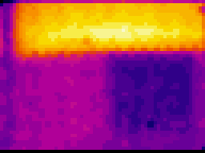

# ThermalCam

***

Yet another ESP32 Thermal Camera

#### Based on:
- [Melexis MLX90640 API ](https://github.com/melexis/mlx90640-library.git "But fixed for this project");
- [Compact Gaussian interpolation for small displays ](http://blog.dzl.dk/2019/06/08/compact-gaussian-interpolation-for-small-displays/ "Dzl TheEvilGenius");
- Espressif ESP32 (In my case WROVER-I bare module);
- ST7735 TFT SPI Display.

#### Enabled:
- 19bit ADC resolution;
- 10x oversampling for a pure smoothie smooth image;
- Gauss interpolation 2x (up to 64x48)px;
- can save raw data on SD card to process on Desktop;
- ~HiQ mode via button for less noisy pics (4Hz speed);~
- ~two color modes: grayscale and normal thermogram;~
- min, max and average temp show;
- more or less clean code without magic numbers.

Work pretty awesome on ESP32 and using it’s dual core feature.
FPS? Hmmm... it’s limited by hardware of IR Sensor. So, typical value is 4Hz or 4FPS.

#### HOWTO

First of all you need to download all that stuff below.


ESP32 dependencies required:
- [ESPAsyncWebServer Library](https://github.com/me-no-dev/ESPAsyncWebServer.git "ESPAsyncWebServer Library git");
- [Arduino core for the ESP32](https://github.com/espressif/arduino-esp32.git "Arduino core for the ESP32 git");


Adafruit dependencies required:
- [Adafruit GFX Library](https://github.com/adafruit/Adafruit-GFX-Library.git "Adafruit GFX Library git");
- [Adafruit ST7735 Library](https://github.com/adafruit/Adafruit-ST7735-Library.git "Adafruit ST7735 Library git");
- [Adafruit BusIO Library](https://github.com/adafruit/Adafruit_BusIO "Adafruit BusIO Library git");


My dependencies required:
- [FreeRTOS Helper](https://github.com/Bismuth208/FreeRTOS-Helper.git "My own FreeRTOS-Helper git")

~Maybe, someday, i will automate this process...~
***


***
Now, use all power of *etherything is file* and make link on linux/nix/bsd systems:
```
ln -s "/Users/YourUserFolderName/Documents/Repos/Git/ThermalCam/mxl90640_lib" "/Users/YourUserFolderName/Documents/Arduino/libraries/mxl90640_lib"
```

And to make my life more simple to work with FreeRTOS download *FreeRTOS-Helper* via link above,
then link same way:
```
ln -s "/Users/YourUserFolderName/Documents/Repos/Git/FreeRTOS-Helper" "/Users/YourUserFolderName/Documents/Arduino/libraries/FreeRTOS-Helper"
```

... and so on for all dependecies.

> But hey!
> I'm a Windows user!
> How i must to instal libraries!?
> What the heck!?!?

Well... hmm... via worst and simple way:
```
on Windows just copy amlost all libraries to "Documents/Arduino/libraries/", except esp-idf
```


***
The end.


***
Knowing Issues:
- If "mlx" folder is empty or doesn't exists then folder "./mlx/4294967295" is created;
- If "mlx" folder contain one folder named for example "0046" then folder numbers starts from "0000";
- Recording series of frames (gif video) to SD causes frames write slowdown;
- Image corruption if shutter button is pressed repeatedly;


> ## :exclamation: ATTENTION! :exclamation:
>  * This project is still unstable and in develop! :beetle:
>  * Any changes are possible at any time! 
>  * and this cat above is awesome!
